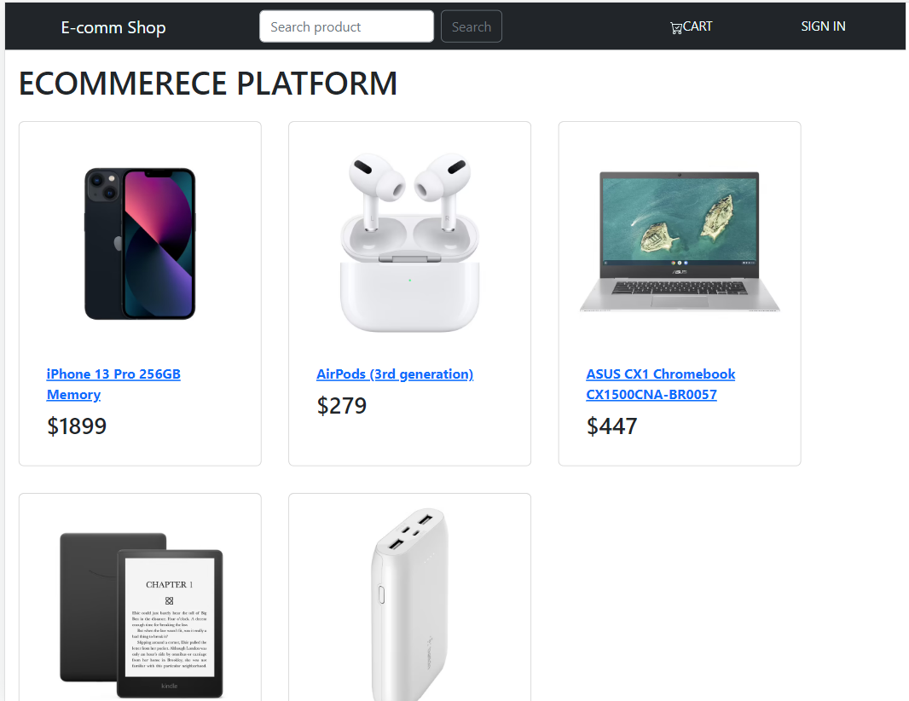
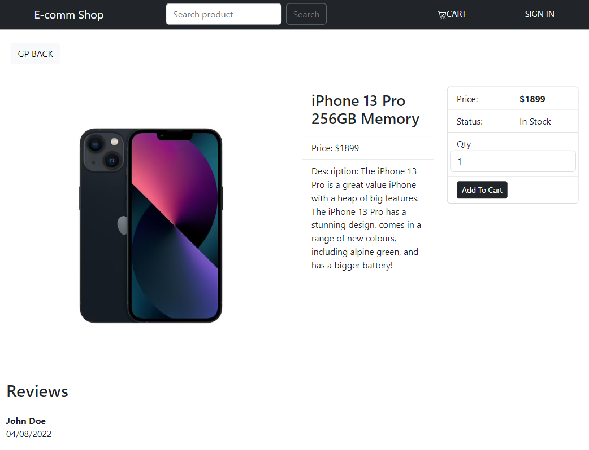
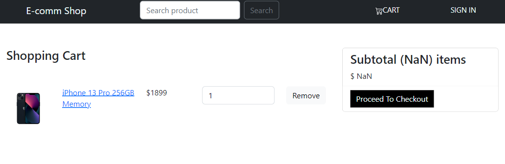

# ecommerce-platform

A full stack web application build with MERN stack, where business can list their products for marketing and advertising purpose.

# Functionality of this app

- platform where business to manage data with Authorization concept to manage products and users data. Users as customers can sign up and log in to buy products.

# Installation

- to run in locally for education purpose
- Download or clone repository.
- Node.js is required to run the application
- npm install to install the required packages as per package.json

# Usage

- use the following link to open the application
- The application will run on any browser.

# live application

[ECOMM PLATFROM](https://ecomm-platformks.herokuapp.com/)

# Below are the sample pages of command line application

## Home Page

## Single Product Page

## Shopping Cart Page

# Features and Technologies uses

- MongoDB
- Express.Js
- React.js
- Node.js
- GraphQL
- Apollo Server

## Under the MIT license

